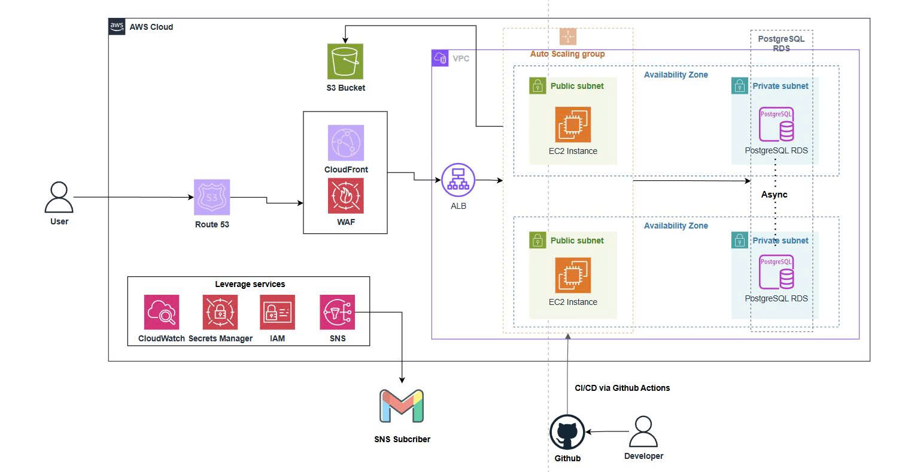

In this section, I summarize the workshop/project proposal for deploying and securing the DIY Shop application on AWS.

# DIY Shop E-commerce Platform

## A Secure AWS-based Solution for Handmade Goods Online Sales

### 1. Executive Summary

DIY Shop is a website built for a handmade-goods and hand-painted artwork business, supporting the shop owner (single-seller) in managing and operating the store online. The application lets customers browse the product catalog and place orders through the website using two payment methods: (1)Cash on Delivery (COD) and (2) Bank Transfer (VietQR). After successfully placing an order, the system lets customers track their order status using the order code received at checkout. On the operational side, a dashboard supports the shop owner in managing the product catalog, controlling inventory, and processing order statuses, with payment status tracked independently from delivery status. The website leverages AWS services to realize automated operations and management.

### 2. Problem Statement

### What’s the Problem?

Sellers of handmade goods and paintings currently lack a dedicated online sales channel to showcase products, take orders, and track inventory. This makes the process error-prone as order volume grows, since there is no shared source of data between the seller and the customer. As a single, non-technical seller - operating without a dedicated technical or operations team - the owner would have to handle tasks beyond their expertise, such as securing customers' personal data (name, phone number, and address collected at checkout) and handling server incidents. This can lead to time-consuming recovery efforts, and even the risk of exposing customer information.

### The Solution

The system is deployed on **Amazon EC2**, running as a managed `systemd` service, connected to an **Amazon RDS PostgreSQL instance** placed in a private subnet (with least-privilege-restricted connectivity); product images are stored on **Amazon S3** via an **IAM role**. **Amazon CloudWatch** collects application and access logs, deriving error metrics from them through metric filters, then triggers email alerts when the error rate exceeds a threshold. **GitHub Actions** automates build, test, and deployment on every code change.

### 3. Solution Architecture

DIY shop is deployed inside a dedicated VPC spanning 2 Avaibility Zones (AZs) to ensure high availability. User requests pass through three layers before reaching the application from Route 32 to CloudFront and WAF then Application Load Balancer. The application runs on EC2 instances managed by an Auto Scaling Group, distributed across 2 AZs in a public subnets. The data consists of RDS PostgreSQL in Multi-AZ mode and S3 for product image storage. The entire operational lifecycle is supported by CloudWatch (monitoring), SNS (alerting), Secrets Manager (credential management), IAM (access control), and GitHub Actions (CI/CD automation).

### AWS Services Used

- **Amazon VPC**: Provides an isolated network with 2 public and 2 private subnets across 2 AZ
- **Amazon EC2**: Hosts the Spring Boot backend, running as a managed `systemd` service in a public subnet
- **Amazon RDS**: Managed relational database and all core transactional data
- **Amazon S3**: Stores product images; the database keeps only a reference
- **Route 53**: resolves the domain to CloudFront
- **CloudFront**: CDN, caches static assets at edge locations
- **AWS IAM**: Enforces least privilege
- **Amazon CloudWatch**: Centralizes application and access logs into log group, derives error-count metrics from those logs via metric filters, and evaluates alarms against them
- **Amazon SNS**: Delivers an email notification whenever a CloudWatch Alarm enters the `ALARM` state
- **Secrets Manager**: stores and automatically rotates DB and seller credentials

### Component Design

- **Edge and Traffic Distribution**: Route 53 resolves the domain to an alias record pointing at CloudFront (static asset caching, WAF attachment). Every request is inspected by WAF before being forwarded to ALB (load balancing, TLS termination).
- **Application Tier**: Auto Scaling Group manages EC2 instances (2 AZs), each running a single Spring Boot `jar` with the React frontend bundled in the same origin, so no CORS needed
- **Data Tier**: RDS PostgreSQL Multi-AZ, use S3 to store product images via IAM Role and presigned URLs
- **Security and Credential Management**: Secret Manager stores DB crendentials; IAM enforces least-privilege access for EC2
- **Observability**: CloudWatch Agent collects logs and metrics. Alarm is responsible for check conditions based on
- **CI/CD**: GitHub Actions automatically builds, tests, and deploys on every push

### 4. Technical Implementation

**Implementation Phases**
The project was delivered in 2 consecutive phases: (1) Core Foundation, (2) Security and Reliability.

About core foundation (2 weeks):

- Provisioned the VPC, Security Groups, RDS PostgreSQL, and EC2; migrated the schema via Flyway onto the real RDS instance
- Set up an S3 bucket with a least-privilege IAM Role for product image storage, validated with a real upload test
- Stabilized the application via a `systemd` service, wired up CloudWatch Agent , Metric Filters, Alarms and SNS. Then, built a GitHub Actions CI/CD pipeline for automated build and deploy, and attached an Elastic IP

About security and reliability (1 weeks):

- **Secrets Manager**: moved all credentials from plaintext files on EC2 to secrets with an audit trail and automatic rotation
- **Multi-AZ RDS**: enabled Multi-AZ on the existing instance, eliminating the single point of failure at the data tier
- **Application Load Balancer**: added a load-balancing and TLS-termination layer, forming the foundation for the Auto Scaling Group
- **AWS WAF**: attached a Web ACL to filter application-layer attacks and rate-limit the login endpoint

**Technical Requirements**

- **Backend**: Java 17, Spring Boot 4.0.6, Spring Data JPA, Flyway (schema versioning), Spring Security (form login + CSRF for the seller portal)
- **Frontend**: React + Vite + TypeScript + Tailwind CSS, bundled directly into Spring Boot's static/ (same-origin, no CORS configuration needed)
- **Database**: PostgreSQL 18 (RDS), schema fully managed through Flyway migrations versioned alongside the source code
- **Infrastructure**: All AWS resources were provisioned via the Console (no IaC, due to time constraints), with each configuration step documented for reuse in the Workshop lab
- **CI/CD**: GitHub Actions, build+test using a PostgreSQL service container that mirrors the real RDS environment in CI

### 5. Timeline & Milestones

**Project Timeline**

- Internship (Months 1-2): 2 months.
  - Month 1: Study AWS and doing labs
  - Month 2: Design architecture, implement, test and launch

### 6. Budget Estimation

You can find the budget estimation on the [AWS Pricing Calculator](https://calculator.aws/#/estimate?id=621f38b12a1ef026842ba2ddfe46ff936ed4ab01).  
Or you can download the [Budget Estimation File](../attachments/budget_estimation.pdf).

### Infrastructure Costs

- AWS Services:
  - AWS Lambda: $0.00/month (1,000 requests, 512 MB storage).
  - S3 Standard: $0.15/month (6 GB, 2,100 requests, 1 GB scanned).
  - Data Transfer: $0.02/month (1 GB inbound, 1 GB outbound).
  - AWS Amplify: $0.35/month (256 MB, 500 ms requests).
  - Amazon API Gateway: $0.01/month (2,000 requests).
  - AWS Glue ETL Jobs: $0.02/month (2 DPUs).
  - AWS Glue Crawlers: $0.07/month (1 crawler).
  - MQTT (IoT Core): $0.08/month (5 devices, 45,000 messages).

Total: $0.7/month, $8.40/12 months

- Hardware: $265 one-time (Raspberry Pi 5 and sensors).

### 7. Risk Assessment

#### Risk Matrix

- Network Outages: Medium impact, medium probability.
- Sensor Failures: High impact, low probability.
- Cost Overruns: Medium impact, low probability.

#### Mitigation Strategies

- Network: Local storage on Raspberry Pi with Docker.
- Sensors: Regular checks and spares.
- Cost: AWS budget alerts and optimization.

#### Contingency Plans

- Revert to manual methods if AWS fails.
- Use CloudFormation for cost-related rollbacks.

### 8. Expected Outcomes

#### Technical Improvements:

Real-time data and analytics replace manual processes.  
Scalable to 10-15 stations.

#### Long-term Value

1-year data foundation for AI research.  
Reusable for future projects.
