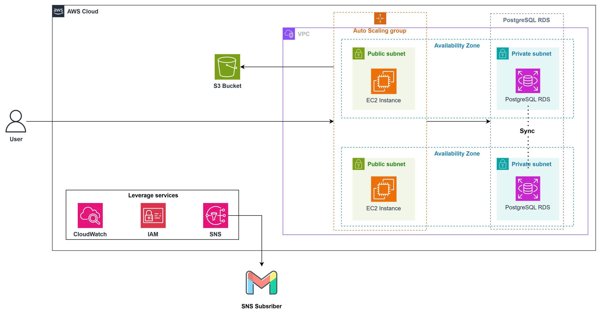

Workshop này hướng dẫn di chuyển an toàn cơ sở dữ liệu của DIY Shop - một ứng dụng thương mại điện tử bán đồ thủ công - từ PostgreSQL cục bộ sang Amazon RDS:

- Đặt RDS trong private subnet không lộ ra Internet công cộng, giới hạn kết nối chỉ cho Security Group của backend
- Cấp quyền truy cập S3 cho ứng dụng thông qua IAM Role thay vì access key tĩnh.

