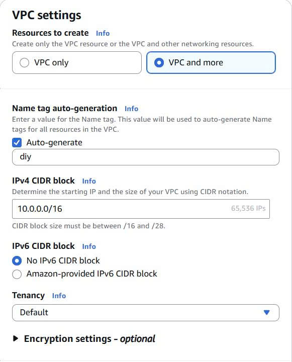
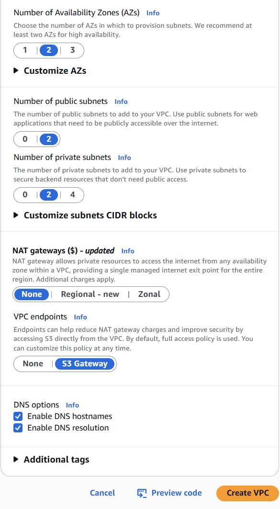
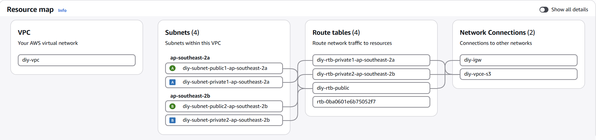
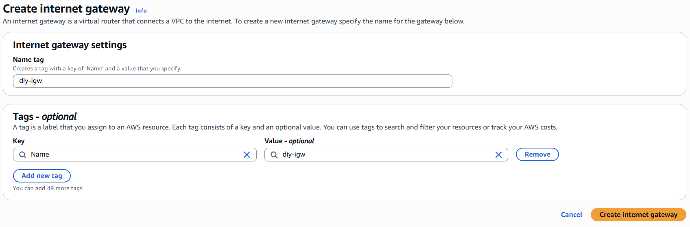
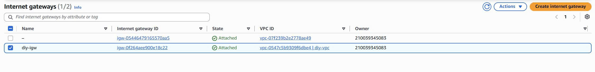
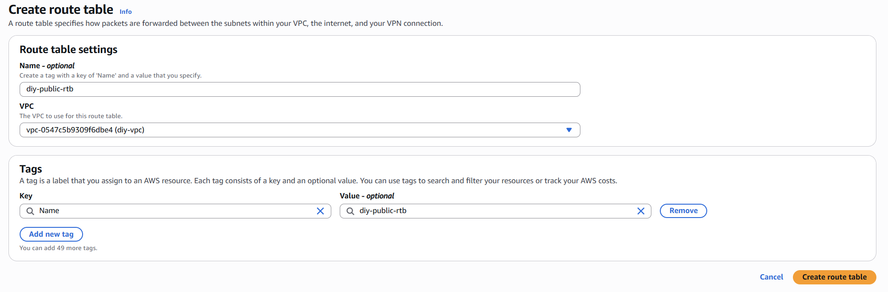
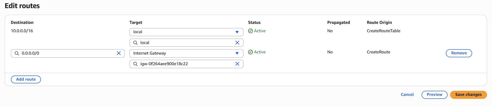
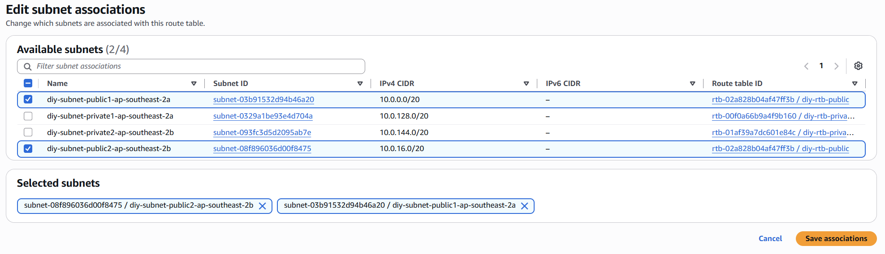
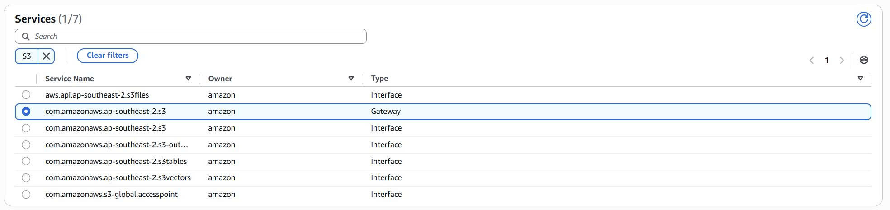
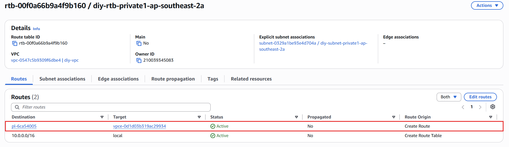

1. **Create VPC**




{}
Please check for high-availability by ensuring that there is **at least 2 AZs**. This leads to **2 public subnets** and **2 private subnets**
{}

After successfully creating VPC with mode `VPC and more`, you have already had 2 private and 2 public subnets like following:



2. **Go to `Internet Gateways` on the sidebar to create gateway for VPC**



3. **Then click on `Actions`, next `Attach to VPC` and choose your created VPC. If success. you will get as the same as following result:**



4. **Config route table for public subnets**



Then click on `Edit Route` in `Actions` to add route:

```json
Destination: 0.0.0.0/0
Target: Internet Gateway - <choose your IGW>
```



Next, click on `Edit subnet association` in `Actions` to add subnet. Choose your 2 public subnet in this step



5. **Config route table for private subnets**

It is similar to the public route table configuration. Instead of choosing public subnets, now choose private subnets

6. **Create S3 gateway VPC endpoint**

Move to the section `Endpoints` in the left sidebar to creation S3 endpoint

```
- Name tag: <enter-your-name>
- Type: AWS Service
```

In the `Services` part, search for `S3` and choose the service name whose type is `Gateway`



For the `Network Settings` and `Route Table`, choose your created VPC and **private subnets**. Keep `Policy` part as default. To verify your result, go back to your private route table and you can see a new route has the formation as `pl-xxxxx`. That is the created endpoint



{}
We don't create **NAT Gateway** because the **EC2 instance** will be placed in pubnet subnet, and **RDS** will communication through **S3 Gateway Endpoint** from private subnet
{}
