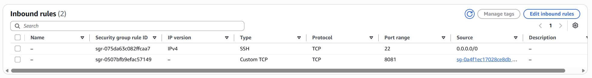
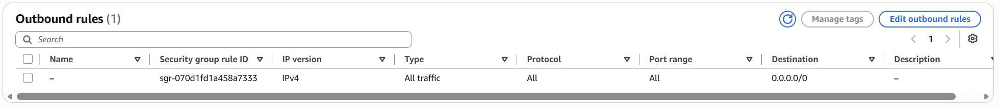
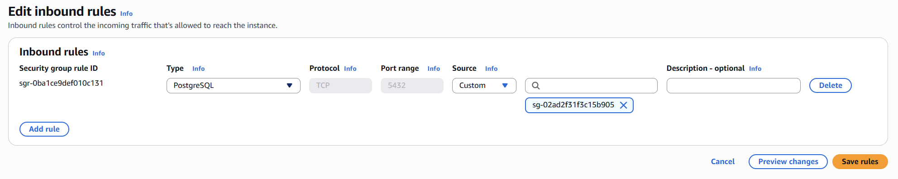
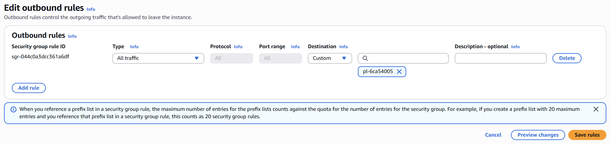

1. **Create security group for EC2**

In VPC console, click on `Security Group` to create security group

```
Security group name: <enter-your-group-name>
Description: <enter-your-description>
VPC: <choose-your-vpc>
```

Next, config inbound rules and keep outbound ones as default:

```
Type: Custom TCP
Port: <enter-your-port>
Source: 0.0.0.0/0 # in this lab, it doesn't include ALB so just keep open

Type: SSH
Port: 22
Source: 0.0.0.0/0
```





2. **Create security group for RDS**

It is similar to the instructions for creating EC2 security group. In the inbound rules, for `Source` option choose `Custom` and click on security group for EC2



In the outbound rules, you will config like this:

```
Type: HTTPS
Port: 443
Destination: Custom - <search-for-prefix-list>
```


