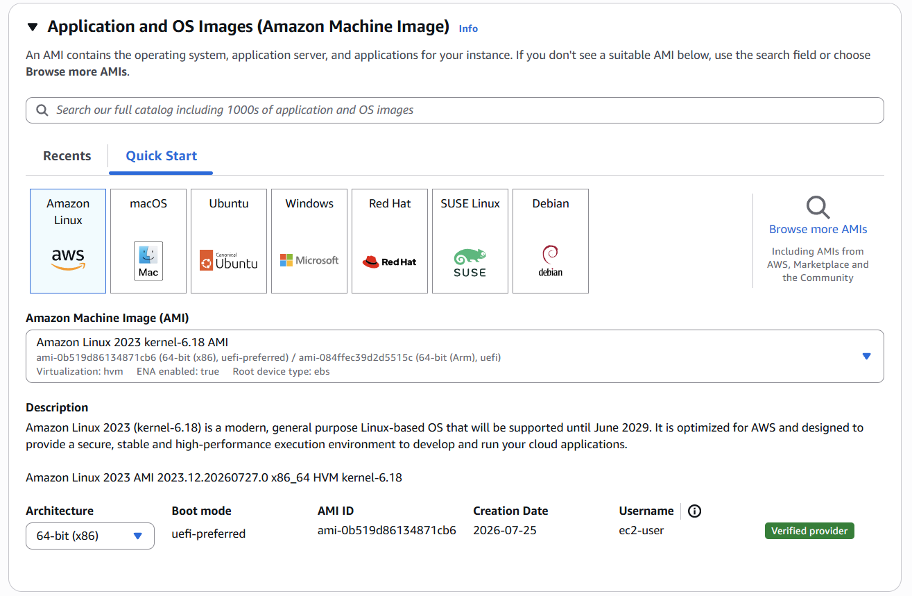
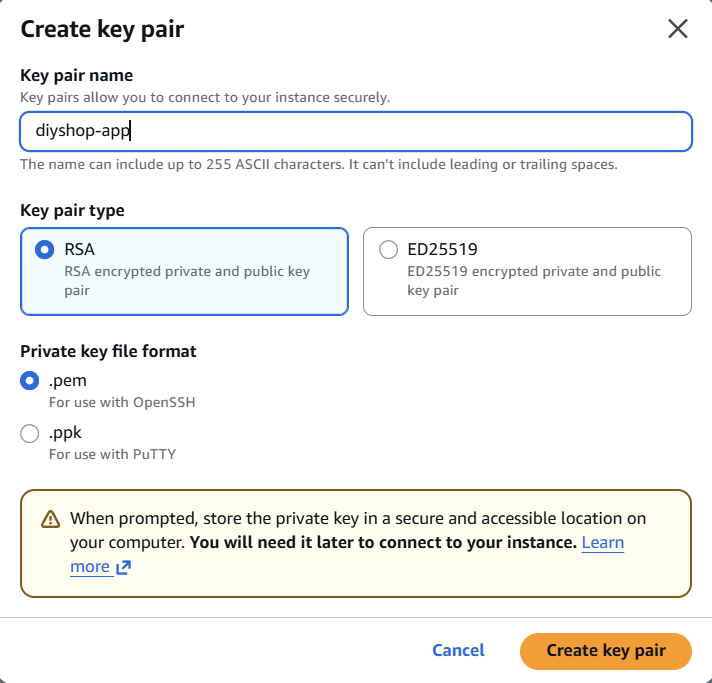
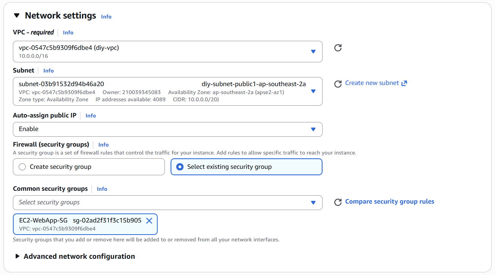
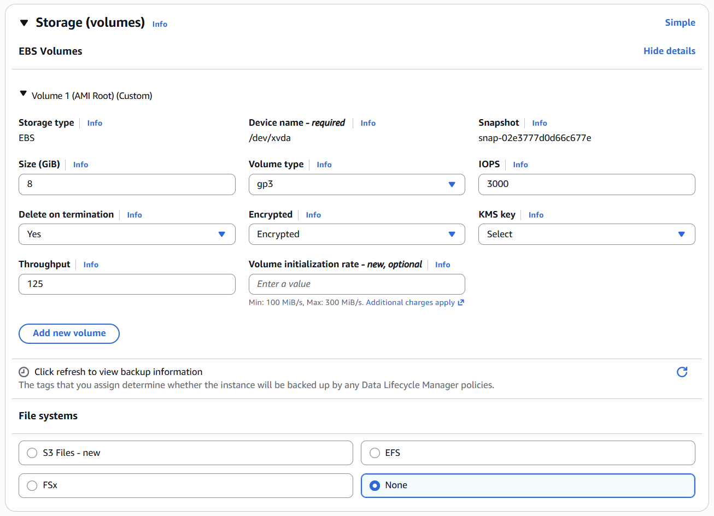

1. **Create EC2 instance**

Access to EC2 console, select `Instances` and choose `Launch instance`. Enter your name of instance in `Name`

Next, choose the OS model for instance. In this lab, i will choose:

```
AMI: Amazon Linux 2023
Instance type: t3.micro
```



Next, in the Key Pair part, create your key with `.pem` file and store it in your device for later use



Next, move to Network Settings. Choose your VPC, public subnet, `enable` for auto-assign public IP (this IP will be changed when instance reboots). For the security group, select your created security group for EC2



Next, move to Storage part. Just enable `Encrypted` for EBS Encryption in advanced setting in this part



2. **Deploy backend to EC2 and connect RDS**

In this step, it depends on your backend technology for the project. In my case as an example, I choose Spring Boot for my backend so I have to install JDK on EC2 and starts to connect to RDS.

First, I will access into my EC2 via command: `ssh -i <your-pem-file-location> <user>@<public-ip>`

If success, you will get something like following:

```bash
┌──(mq㉿mqngyn)-[~]
└─$ ssh -i ~/diy-app.pem ec2-user@52.65.133.54
** WARNING: connection is not using a post-quantum key exchange algorithm.
** This session may be vulnerable to "store now, decrypt later" attacks.
** The server may need to be upgraded. See https://openssh.com/pq.html

A newer release of "Amazon Linux" is available.
  Version 2023.12.20260724:
  Version 2023.12.20260727:
Run "/usr/bin/dnf check-release-update" for full release and version update info
   ,     #_
   ~\_  ####_        Amazon Linux 2023
  ~~  \_#####\
  ~~     \###|
  ~~       \#/ ___   https://aws.amazon.com/linux/amazon-linux-2023
   ~~       V~' '->
    ~~~         /
      ~~._.   _/
         _/ _/
       _/m/'
Last login: Thu Jul 30 09:57:45 2026 from 116.100.247.223
[ec2-user@ip-10-0-13-67 ~]$
```

Now, i will install JDK into my EC2 instance via `sudo dnf install -y java-17-amazon-corretto`. Then I build `.jar` and copy to EC2:

```bash
./mvnw clean package -DskipTests
scp -i <your-pem-key> <jar-location-after-build> ec2-user@<public-ip>:/home/ec2-user/app.jar
```

In this project, I set up a `systemd` service for the Spring Boot application on EC2 so it runs as a persistent background process - automatically restarting on failure `(Restart=on-failure)` and starting again after an EC2 reboot - instead of relying on a manual `java -jar app.jar` session that dies the moment the SSH connection closes

```bash
[ec2-user@ip-10-0-13-67 ~]$ cat /etc/systemd/system/diyshop.service
[Unit]
Description=DIY Shop Spring Boot App
After=network.target

[Service]
Type=simple
User=ec2-user
EnvironmentFile=/etc/diyshop/env
ExecStart=/usr/bin/java -jar /home/ec2-user/app.jar
Restart=on-failure
RestartSec=5

[Install]
WantedBy=multi-user.target
```

Notes that in the `env` file, I have defined all necessary variables for my application and connection to RDS such as `SPRING_DATASOURCE_URL`, `SPRING_DATASOURCE_USERNAME`, `SPRING_DATASOURCE_PASSWORD`

Then, you can test via command `sudo systemctl status <your-app-name>`. If the status is active, you success:

```bash
[ec2-user@ip-10-0-13-67 ~]$ sudo systemctl status diyshop
● diyshop.service - DIY Shop Spring Boot App
     Loaded: loaded (/etc/systemd/system/diyshop.service; enabled; preset: disabled)
     Active: active (running) since Thu 2026-07-30 17:20:19 UTC; 8s ago
   Main PID: 16654 (java)
      Tasks: 18 (limit: 1059)
     Memory: 170.1M
        CPU: 15.473s
     CGroup: /system.slice/diyshop.service
             └─16654 /usr/bin/java -jar /home/ec2-user/app.jar
```

Next, testing for your connection to RDS. First, access to PostgreSQL RDS via: `psql -h diyshop-db-instance.cdcmqck2qzuj.ap-southeast-2.rds.amazonaws.com -p 5432 -U <master_username> -d diyshop`. Then run, `SELECT version, description, success FROM flyway_schema_history;` to verify your flyway:

```bash
diyshop=> SELECT version, description, success FROM flyway_schema_history;
 version |          description          | success
---------+-------------------------------+---------
 1       | create categories             | t
 2       | create products               | t
 3       | create product images         | t
 5       | create orders                 | t
 6       | add product image storage     | t
 4       | seed initial catalog          | t
 7       | seed additional mock data     | t
 8       | add order cancellation reason | t
 9       | create shop settings          | t
(9 rows)
```

If `success = t`, your migration is fine
