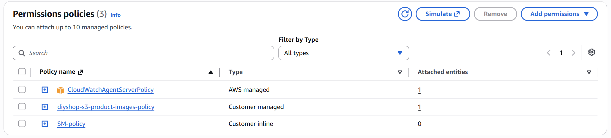
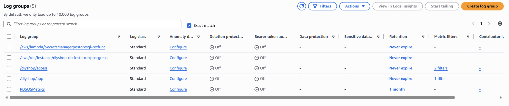
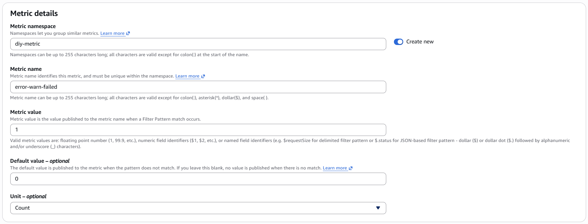
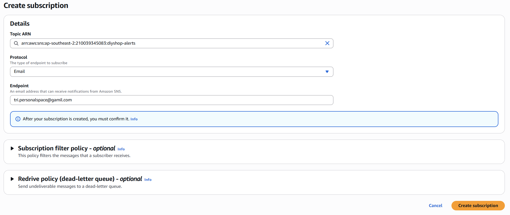
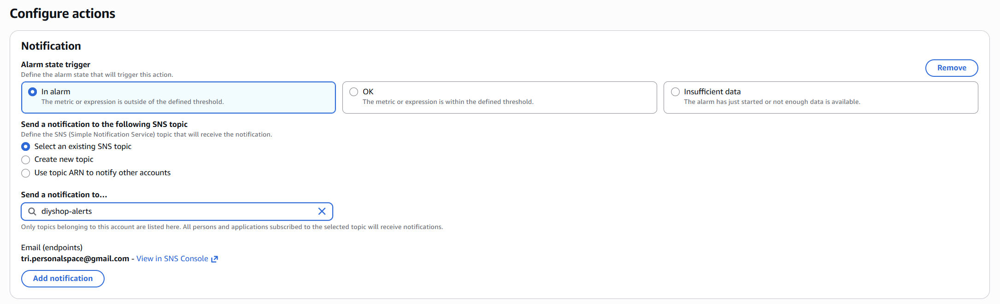
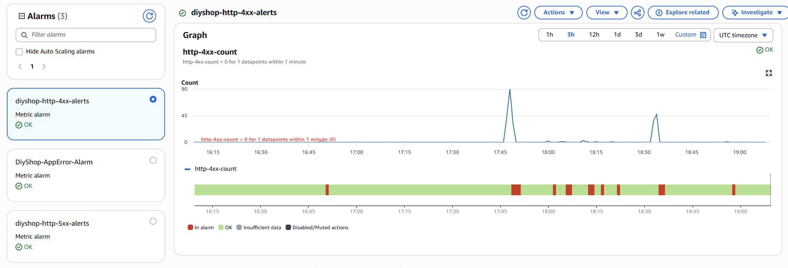
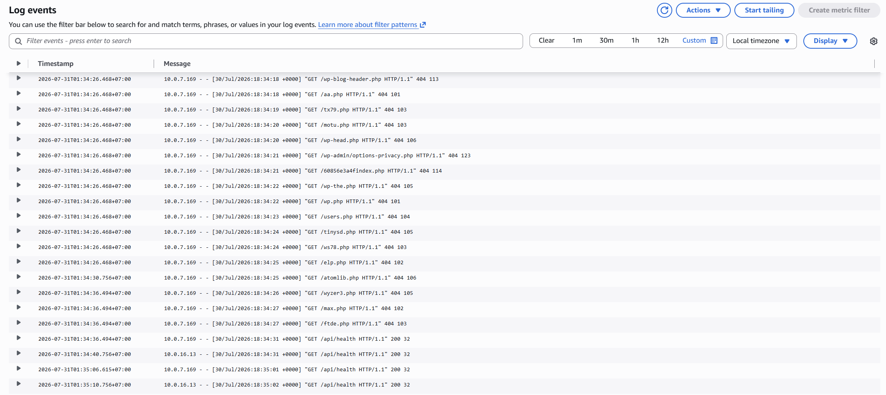
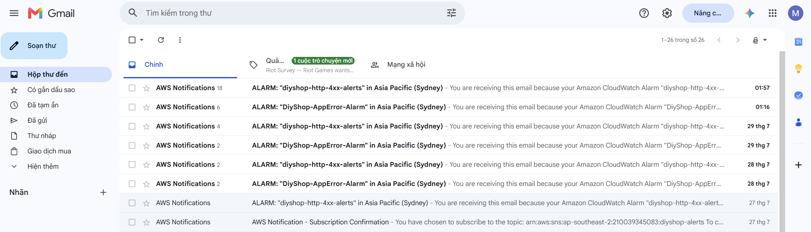

1. **Install CloudWatch in EC2**

SSH into your EC2 and install CloudWatch Agent via: `sudo dnf install -y amazon-cloudwatch-agent`

Next, add permission for CloudWatch Agent to send log or metric in EC2 role



2. **Create configuration for CloudWatch Agent in EC2**

```bash
{
  "logs": {
    "logs_collected": {
      "files": {
        "collect_list": [
          {
            "file_path": "/home/ec2-user/app.log",
            "log_group_name": "/diyshop/app",
            "log_stream_name": "{instance_id}"
          },
          {
            "file_path": "/var/log/tomcat/access.log",
            "log_group_name": "/diyshop/access",
            "log_stream_name": "{instance_id}"
          }
        ]
      }
    }
  }
}

```

Then start the created configuration, example:

```bash
sudo /opt/aws/amazon-cloudwatch-agent/bin/amazon-cloudwatch-agent-ctl \
  -a fetch-config -m ec2 -s -c file:/opt/aws/amazon-cloudwatch-agent/etc/config.json
```

Next, verify on CloudWatch console:



3. **Create metric filters**

Access CloudWatch console, select `Log Management` and choose for the log group, then move to `Metric filters` tab. When create metric filter, we need to fill a filter pattern (e.g. ?ERROR ?WARN ?FAILED - that means I want to filter the response which contains error, warns or failed keyword)

For the second step, do as following":


Notes for `namespace`, for other metric filters are required to be in the same namespace

Then, I do similarly for metric filter `http-4xx-count` and `http-5xx-count` which filters the respoonse whose status code in pattern 4xx and 5xx.

4. **Create Alarm and SNS**

First, I create the SNS topic as those previous steps, so just access SNS console, select Topics and create topics

Second, I create subscription. At `Protocol`, choose `Email` and enter your email which receives the alarms



Third, I create the alarm for each metrics with statistic `SUM` for efficiency. Threshold I set `Greater than 0` and in `1 minute`. At `Configure Actions`, config as following to get the notifications when alarms:



Now, if I access any endpoint or try to trigger the alarms, there will be logs, alarms in my email and also graph for statistics:






